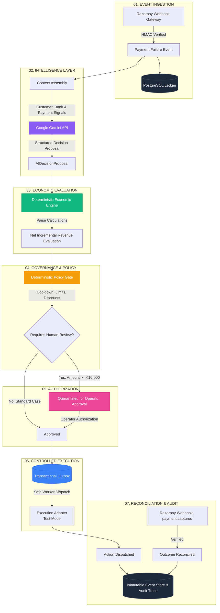

# Financial Agent Lab

> **AI Revenue Recovery Control Plane**  
> *Track 03 — AI Revenue Recovery | Razorpay AI Buildathon 2026*  
>

---

### Core Thesis
> *"A payment failure is an event, not a diagnosis."*  
> Don't just blindly retry every failure. Diagnose the failure context, evaluate net incremental economics against natural recovery, enforce deterministic policy boundaries, require human approval for high-value actions, and control execution through transactional infrastructure.

---

## 1. Overview

**Financial Agent Lab** is an AI-assisted revenue recovery control plane designed for merchants and payment platforms. It focuses specifically on **failed one-time payments** (UPI, Card, Netbanking, and Wallets), transforming raw payment failure webhooks into context-aware, economically evaluated, and policy-governed recovery decisions.

### What Makes This System Different
* **AI Proposes, Deterministic Code Governs:** Large Language Models (Google Gemini API) diagnose payment failure context and propose recovery actions. Deterministic code calculates monetary values, validates merchant risk policies, and controls execution.
* **Optimize for Incremental Revenue, Not Retries:** The system distinguishes intervention-driven recovery from **natural recovery** (customers recovering on their own), intervening only when expected net incremental revenue exceeds intervention and inference costs.
* **Bounded Autonomy & Human-in-the-Loop:** High-value recovery actions (e.g., $\ge \text{₹}10,000$) are quarantined awaiting administrator authorization.
* **Protected Financial Execution:** An ACID-compliant Transactional Outbox prevents duplicate or unvalidated external side effects.
* **Separation of Concerns:** Recommendation $\neq$ Execution $\neq$ Captured Revenue. Captured revenue is recognized only upon cryptographically verified Razorpay webhook reconciliation.

---

## 2. Problem & Architectural Rationale

When a customer encounters a payment failure, legacy recovery systems typically trigger immediate blind retries or spam generic payment links. This causes four major operational problems:
1. **Customer Fatigue & Drop-off:** Inappropriate notifications frustrate customers who experienced transient bank outages.
2. **Gateway Penalties & Rate Limiting:** Repeated retries during bank/network downtimes degrade gateway health scores.
3. **Negative Unit Economics:** Interventions cost money (SMS, WhatsApp, payment link gateway fees, manual VIP escalation). Intervening when a customer would have naturally retried destroys margin.
4. **Unconstrained Financial Risk:** Automated systems lacking merchant risk thresholds can trigger unauthorized discounts or unvetted high-value actions.

Financial Agent Lab replaces heuristic retry loops with an end-to-end 7-stage control plane.

---

## 3. End-to-End Control Plane Architecture

The control plane implements a strict 7-stage lifecycle for every payment failure event:



### The 7 Stages Explained

| Stage | Name | Component | Authoritative Function |
|---|---|---|---|
| **01** | **Event** | Webhook Gateway | Ingests failure event with HMAC signature verification; creates durable `RecoveryCase`. |
| **02** | **Intelligence** | Google Gemini API | Evaluates payment, customer, error, and temporal signals to propose a structured recovery action and reasoning. |
| **03** | **Economics** | Economic Engine | Deterministically computes expected net incremental revenue in integer minor units (paise). |
| **04** | **Governance** | Policy Engine | Enforces merchant policy rules (attempt limits, cooldown periods, discount caps). |
| **05** | **Authorization** | Approval Gate | Quarantines high-value actions ($\ge \text{₹}10,000$) until human administrator sign-off. |
| **06** | **Execution** | Transactional Outbox | Enqueues approved actions atomically; worker dispatches via test-mode execution adapters. |
| **07** | **Outcome** | Reconciliation & Audit | Reconciles captured payments from subsequent webhooks and stores immutable audit logs. |

---

## 4. AI Decision Layer (Google Gemini API)

The AI layer uses Google's official Gemini API (`gemini-flash-latest`) via `GeminiRESTClient` to provide structured reasoning.

### Context Provided to Gemini
* **Payment Signals:** Amount in paise, payment method (UPI, CARD, NETBANKING), failure reason code (e.g., `BAD_REQUEST_AUTHENTICATION_FAILED`, `GATEWAY_TIMEOUT`).
* **Customer Context:** Customer tier (VIP, STANDARD, NEW), historical lifetime value, prior recovery success rate.
* **Temporal Signals:** Time elapsed since failure, hour of day, day of week.
* **Merchant Constraints:** Permitted action types, maximum allowable discount percentage.

### Structured Output Schema (`AIDecisionProposal`)
Gemini returns a strictly typed JSON payload validated against Pydantic models:
```json
{
  "recommended_action": "PAYMENT_LINK",
  "confidence": 0.85,
  "reasoning_codes": [
    "CUSTOMER_AUTHENTICATION_FAILURE",
    "VIP_CUSTOMER",
    "ACTIONABLE_DROPOFF",
    "HIGH_HISTORICAL_CONVERSION"
  ],
  "reasoning_narrative": "Customer drop-off during high-value authentication; sending a payment link maximizes conversion for VIP segment.",
  "discount_percent_offered": 0,
  "cooldown_minutes_recommended": 15,
  "requires_human_review": true
}
```

### What Gemini Does NOT Control
* ❌ **No direct database writes:** Gemini never mutates ledger records or transitions payment statuses.
* ❌ **No financial calculations:** Gemini does not compute monetary amounts, margins, or net recovery values.
* ❌ **No execution access:** Gemini has zero access to payment gateway execution credentials.
* ❌ **No policy bypass:** A high confidence score from Gemini cannot override merchant policy gates or quarantine thresholds.

---

## 5. Deterministic Economic Decisioning

The Economic Engine (`domain/intelligence/economic_engine.py`) operates as a pure, deterministic function using exact integer arithmetic (paise):

$$\text{Expected Net Incremental Revenue} = \mathbb{E}[\text{Gross Revenue}] - \mathbb{E}[\text{Natural Revenue}] - \text{Intervention Cost} - \text{AI Cost}$$

Where:
$$\mathbb{E}[\text{Gross Revenue}] = \text{Amount} \times P(\text{Recovery} \mid \text{Action}) \times (1 - \text{Discount})$$
$$\mathbb{E}[\text{Natural Revenue}] = \text{Amount} \times P(\text{Natural Recovery})$$
$$\mathbb{E}[\text{Incremental Revenue}] = \mathbb{E}[\text{Gross Revenue}] - \mathbb{E}[\text{Natural Revenue}]$$
$$\mathbb{E}[\text{Net Incremental Revenue}] = \mathbb{E}[\text{Incremental Revenue}] - \text{Cost}_{\text{intervention}} - \text{Cost}_{\text{AI}}$$

### Recovery Actions & Unit Costs

| Action Type | Description | Unit Cost (Paise / INR) | Use Case |
|---|---|---|---|
| `WAIT` | No intervention (rely on natural recovery) | 0 paise (₹0.00) | Low-probability or self-correcting failures. |
| `RETRY` | Automated gateway retry | 20 paise (₹0.20) | Transient network glitches and gateway timeouts. |
| `PAYMENT_LINK` | SMS / Email / WhatsApp payment link | 50 paise (₹0.50) | Customer authentication drop-offs and session expiry. |
| `NOTIFY` | Push notification / Reminder alert | 15 paise (₹0.15) | UPI intent app drop-offs. |
| `ESCALATE` | High-touch VIP support routing | 500 paise (₹5.00) | High-value VIP failures requiring white-glove assistance. |

---

## 6. Safety, Bounded Autonomy & Policy Gates

```
  ┌─────────────────┐       ┌─────────────────┐       ┌─────────────────┐       ┌─────────────────┐
  │  GEMINI PROPOSES│  ──►  │ ECONOMIC ENGINE │  ──►  │  POLICY ENGINE  │  ──►  │  HUMAN OPERATOR │
  │ Action & Reason │       │ Evaluates Value │       │ Constrains Risk │       │ Approves >=₹10k │
  └─────────────────┘       └─────────────────┘       └─────────────────┘       └─────────────────┘
                                                                                         │
                                                                                         ▼
                                                                                ┌─────────────────┐
                                                                                │OUTBOX EXECUTION │
                                                                                │ Protected Queue │
                                                                                └─────────────────┘
```

1. **Deterministic Policy Gate (`domain/policies/validator.py`):**
   * Maximum 3 intervention attempts per recovery case.
   * Minimum 15-minute cooldown between consecutive actions.
   * Maximum discount cap enforced (e.g., $\le 10\%$).
2. **High-Value Quarantine Threshold:** Any recovery action on a transaction $\ge \text{₹}10,000$ ($1,000,000\text{ paise}$) is placed in `PENDING_APPROVAL` status and cannot execute until an administrator approves via `POST /recovery-actions/{id}/approve`.
3. **Transactional Outbox Pattern (`infrastructure/database/orm/outbox.py`):**
   * Action approval and outbox event creation occur within the same ACID database transaction.
   * Dispatches are idempotent with unique `idempotency_key` identifiers.
4. **Test-Mode Execution Boundary:** All external dispatch adapters operate in test mode (`TEST_PLINK_*`, `TEST_RETRY_*`) ensuring zero unintended financial side effects.

---

## 7. Concrete Demo Cases

### Case A: ₹25,000 High-Value Drop-off (Live Gemini Decision)
* **Payment Failure:** ₹25,000 (`amount_paise: 2500000`), VIP Customer, UPI drop-off.
* **Gemini Reasoning:** `PAYMENT_LINK` recommendation, confidence `0.85`, reasoning: `CUSTOMER_AUTHENTICATION_FAILURE`, `VIP_CUSTOMER`.
* **Economic Valuation:**
  * Expected Gross: ₹21,250.00
  * Natural Recovery: ₹10,000.00
  * Expected Net Incremental: **+₹11,249.49** (₹11,250 − ₹0.50 action cost − ₹0.01 AI cost).
* **Policy Check:** Exceeds ₹10,000 threshold $\rightarrow$ **Quarantined for Human Approval**.
* **Governance Action:** Administrator signs off in the Approvals control room; action transitioned to `APPROVED` and dispatched to Outbox.

### Case B: ₹2,500 Standard Technical Retry (Automated Path)
* **Payment Failure:** ₹2,500 (`amount_paise: 250000`), Standard Customer, Card gateway timeout.
* **Gemini Reasoning:** `RETRY` recommendation, confidence `0.78`.
* **Economic Valuation:** Expected Net Incremental: **+₹1,199.79**.
* **Policy Check:** Within ₹10,000 threshold, zero cooldown violations $\rightarrow$ **Automatically Approved**.
* **Governance Action:** Action enqueued and dispatched immediately via Outbox.

---

## 8. Simulation & Digital-Twin Benchmark

The repository includes a high-throughput digital-twin simulation engine (`domain/intelligence/simulation/`) capable of evaluating 1,000+ synthetic scenarios in under 1 second:

```
POST /simulation/run  {"scenario_count": 1000, "seed": 42}
```

### Strategies Evaluated
1. **No Intervention (Baseline):** Measures the natural recovery baseline where the system takes no action (`WAIT`).
2. **Deterministic Baseline:** Heuristic rules without contextual AI or economic margin modeling.
3. **Economic Oracle (Reference Bound):** A theoretical mathematical ceiling assuming perfect counterfactual knowledge under simulator assumptions.

> **Important Disclosure:** The Economic Oracle is a theoretical benchmark ceiling, not the AI agent. Simulation results represent synthetic digital-twin benchmarks and do not represent realized Razorpay production revenue.

---

## 9. Technology Stack

| Layer | Technology | Purpose |
|---|---|---|
| **Backend Framework** | Python 3.12+, FastAPI 0.115+ | High-performance asynchronous REST API |
| **Database & ORM** | PostgreSQL 16, SQLAlchemy 2.0 (AsyncIO), asyncpg | ACID ledger, Outbox, and append-only audit trail |
| **Database Migrations** | Alembic (10 versioned revisions) | Versioned schema migrations |
| **AI Reasoning** | Google Gemini API (`gemini-flash-latest`) | Contextual recovery diagnosis & structured proposal |
| **Validation** | Pydantic v2, Pydantic-Settings | Strict schema validation and typed configuration |
| **Frontend UI** | React 19, TypeScript, Vite 8 | Dark fintech control-plane interface |
| **Icons & Styling** | Lucide React, Custom CSS Tokens | Responsive enterprise dashboard aesthetics |
| **Integration Gateway**| Razorpay Webhook Gateway (Test Mode) | HMAC SHA256 webhook ingestion & reconciliation |
| **Testing** | Pytest, Pytest-Asyncio, HTTPX | 306 passing unit and resilience tests |

---

## 10. Repository Structure

```
financial-agent-lab/
├── alembic/                      # Database migrations (10 versioned revisions)
│   └── versions/
├── apps/                         # Application entry points & API routes
│   └── api/
│       ├── middleware/           # Correlation ID & structured exception handlers
│       ├── routes/               # health, webhooks, ai_decisions, approvals, observability, simulation
│       ├── security/             # Admin API key authentication
│       ├── main.py               # FastAPI application factory & lifespan
│       └── settings.py           # Typed environment settings
├── domain/                       # Core domain business logic (framework-independent)
│   ├── customers/                # Customer models & context
│   ├── intelligence/             # Gemini client, Economic Engine, Baseline, Oracle, Simulator
│   │   ├── ai/                   # AI prompt templates, evaluator, audit snapshot service
│   │   ├── models/               # Action economics, context, structured schemas
│   │   └── simulation/           # Synthetic scenario generator, counterfactual evaluator
│   ├── merchants/                # Merchant entities & policies
│   ├── observability/            # Operational summaries & metrics evaluators
│   ├── payments/                 # Payment aggregate, attempt states, state machines
│   ├── policies/                 # Deterministic policy validation & risk gates
│   ├── recovery/                 # Control plane, orchestrator, approval service, execution outbox
│   └── shared/                   # Currency, Enums, Value objects
├── frontend/                     # React 19 + TypeScript + Vite control room
│   ├── src/
│   │   ├── api/                  # Typed fetch client & API error wrappers
│   │   ├── components/           # Navigation, Header, Metric Cards, Status Badges
│   │   ├── hooks/                # React query & observability polling hooks
│   │   ├── types/                # Navigation & schema interfaces
│   │   └── views/                # Landing, Operations, Decisions, Approvals, Economics, Simulation, Audit
│   └── package.json
├── infrastructure/               # External adapters & persistence
│   ├── ai/                       # Gemini REST client with rate limiting & error handling
│   ├── database/                 # SQLAlchemy async engine, session factory, ORM models
│   ├── gateways/                 # Razorpay test-mode webhook parser & HMAC verification
│   └── logging.py                # Structured JSON logging
├── scripts/                      # Local verification & seed scripts
├── tests/                        # Comprehensive test suite
│   ├── unit/                     # 306 passing unit tests (domain, economics, policies, resilience)
│   └── integration/              # Real database integration tests
├── .env.example                  # Environment configuration template
├── docker-compose.yml            # PostgreSQL 16 service definition
├── pyproject.toml                # Python dependencies & build configuration
└── README.md                     # Project technical documentation
```

---

## 11. Running Locally

### Prerequisites
* **Python:** $\ge 3.12$
* **Node.js:** $\ge 20$
* **Docker & Docker Compose** (for PostgreSQL)
* **Google Gemini API Key** (optional; mock provider is available out-of-the-box)

### Step 1: Clone Repository & Configure Environment
```bash
git clone https://github.com/SubbaReddyK-18/financial-agent-lab.git
cd financial-agent-lab

# Create .env from template
cp .env.example .env
```

Edit `.env` to configure your credentials:
```ini
DB_HOST=localhost
DB_PORT=5432
DB_NAME=financial_agent_lab
DB_USER=fal_user
DB_PASSWORD=changeme_local_only

APP_ENV=development
API_HOST=0.0.0.0
API_PORT=8000
ADMIN_API_KEY=fal-local-demo-admin
RAZORPAY_WEBHOOK_SECRET=test_webhook_secret_local

# AI Configuration (Gemini)
AI_PROVIDER=gemini
AI_MODEL=gemini-flash-latest
AI_API_KEY=your_gemini_api_key_here
```

### Step 2: Start PostgreSQL
```bash
docker compose up -d postgres
```

### Step 3: Set Up Python Virtual Environment & Apply Migrations
```bash
# Create and activate virtual environment
python -m venv .venv
# On Windows:
.\.venv\Scripts\activate
# On Linux/macOS:
# source .venv/bin/activate

# Install dependencies
pip install -e ".[dev]"

# Apply database migrations to head
alembic upgrade head
```

### Step 4: Start FastAPI Backend Server
```bash
python -m uvicorn apps.api.main:app --host 0.0.0.0 --port 8000 --reload
```
* Backend API documentation: `http://localhost:8000/docs`
* Health probe: `http://localhost:8000/health`
* Readiness probe: `http://localhost:8000/ready`

### Step 5: Start Frontend Development Server
In a new terminal:
```bash
cd frontend
npm install
npm run dev
```
* Open `http://localhost:5173` in your browser.

---

## 12. Verification & Test Status

```bash
# Run 306 unit tests
pytest tests/unit/ -q

# Run frontend TypeScript check & production build
cd frontend
npx tsc -b
npm run build
```

| Verification Check | Target / Command | Result |
|---|---|---|
| **Python Unit Tests** | `pytest tests/unit/ -q` | **306 / 306 PASSED** |
| **Frontend TypeScript** | `npx tsc -b` | **0 errors** |
| **Frontend Production Build** | `npm run build` | **Built in 1.68s** (`dist/` generated) |
| **Live Gemini Decision** | `GeminiRESTClient.generate_decision()` | **200 OK** (8.6s, structured proposal) |
| **Liveness & Readiness** | `GET /health`, `GET /ready` | **200 OK** (`{"database": "connected", "ai_provider": "gemini"}`) |

---

## 13. Evaluator Demo Walkthrough (5-Minute Tour)

1. **Landing Page (`/`):** View product thesis, problem breakdown, 7-stage architecture, and the economic equation. Click **"Open Control Plane"** to enter.
2. **Operations View:** Inspect aggregate recovery metrics, decision distribution, and recent real-time payment failure cases.
3. **Decisions View:** Examine the **₹25,000 hero case**. Inspect Gemini's structured reasoning codes, the Economic Engine's net incremental revenue breakdown, and the 7-stage execution timeline.
4. **Approvals View:** View the **human-in-the-loop governance quarantine**. Observe how transactions $\ge \text{₹}10,000$ are safely held for administrator authorization with complete audit logs.
5. **Economics View:** Review net incremental revenue accounting, natural recovery deductions, and unit cost breakdowns.
6. **Simulation View:** Trigger a live **1,000-scenario digital-twin experiment** comparing No-Intervention, Deterministic Heuristics, and the Economic Oracle.
7. **Audit Trace View:** Inspect append-only financial events, AI decision audit snapshots, and Transactional Outbox dispatches.

---

## 14. Scope & Roadmap

### Currently Implemented
* ✅ **Concrete Wedge:** Failed one-time payment recovery (UPI, Card, Netbanking, Wallet).
* ✅ **Live AI Integration:** Google Gemini API (`gemini-flash-latest`) structured decisioning.
* ✅ **Deterministic Engines:** Integer paise Economic Engine & Merchant Policy Gate.
* ✅ **Human Governance:** Quarantined approval workflow for high-value interventions ($\ge \text{₹}10,000$).
* ✅ **Transactional Outbox:** ACID outbox table with idempotent test-mode execution adapters.
* ✅ **Digital-Twin Simulator:** 1,000-scenario counterfactual evaluation engine.
* ✅ **Full-Stack Interface:** Responsive dark fintech control room with live PostgreSQL telemetry.

### Future Expansion
* 🔮 **Subscription & Mandate Recovery:** Intelligent retry schedules and pre-debit notifications for recurring payments.
* 🔮 **B2B Invoice Receivables:** Multi-stage dunning workflows and dynamic credit terms.
* 🔮 **Checkout Abandonment Recovery:** Pre-failure intent recovery.
* 🔮 **Voice & Conversational Agents:** AI voice outreach for high-value merchant escalations.

---

## 15. Limitations & Disclosures

1. **Razorpay Test Mode:** All payment events and webhooks are demonstrated against Razorpay Test Mode. The project does not execute real-money movements or live production charges.
2. **Synthetic Simulation:** Simulation numbers are synthetic digital-twin benchmarks used to evaluate policy heuristics; they do not represent real historical merchant recovery revenue.
3. **Economic Oracle Distinction:** The Economic Oracle is a mathematical reference ceiling, not our AI model.
4. **Zero Financial Authority for LLMs:** The AI only generates structured proposals; execution is strictly gated by deterministic policy, human authorization, and transactional outbox infrastructure.

---

## 16. Author

* **Solo Developer:** Subba Reddy K
* **Project:** Financial Agent Lab
* **Submission Track:** Track 03 — AI Revenue Recovery
* **Event:** Razorpay AI Buildathon 2026
